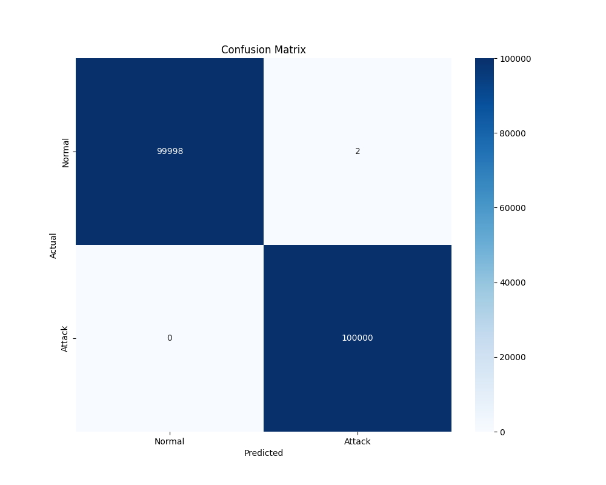
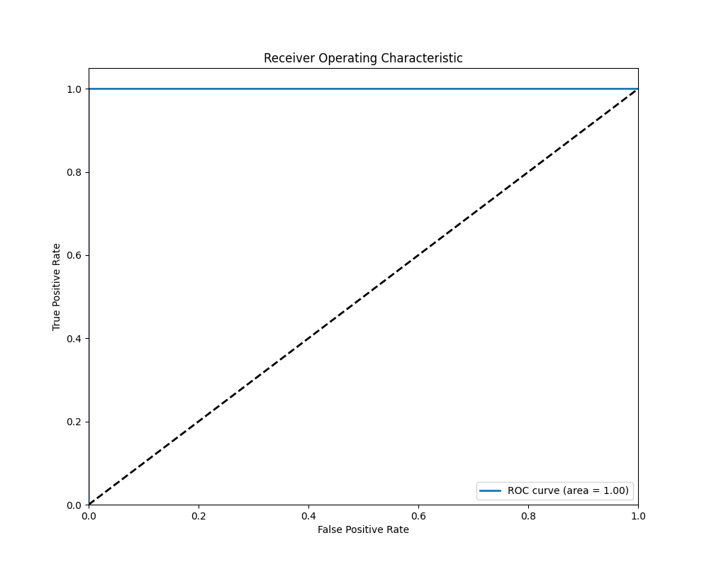

### Training Process

The neural network was trained using a combined dataset of:
- Real network traffic from the UNSW_2018_IoT_Botnet_Dataset
- Synthetic traffic patterns generated to cover additional attack scenarios

This hybrid approach ensures that the model can detect both known attack patterns from the original dataset and novel attacks represented in the synthetic data. The training process used:

- 80% of the real data for training
- 70% of the synthetic data for training
- Remaining portions of both datasets for validation and testing

This split allowed for comprehensive evaluation on both the original data distribution and synthetic attack scenarios.# IoT DDoS Protection System

A lightweight neural network-based solution for detecting and preventing Distributed Denial of Service (DDoS) attacks on Internet of Things (IoT) devices. This project processes network traffic data, builds machine learning models for attack detection, and deploys these models via a containerized API.

## Project Overview

IoT devices are increasingly targeted by DDoS attacks due to their limited security capabilities and widespread deployment. This project uses a combination of real-world data from the UNSW_2018_IoT_Botnet_Dataset and synthetic data for training and testing. The project aims to:

1. Process and clean raw network traffic data
2. Extract meaningful features for DDoS attack detection
3. Train a lightweight neural network suitable for resource-constrained environments
4. Optimize the model for low-power deployments (TensorFlow Lite)
5. Deploy the model via a containerized API for integration into existing security infrastructure

## Repository Structure

```
📁 IoT-DDoS-Protection/
├── 📁 Models/                      # Trained models and preprocessing components
│   ├── ddos_model_20250412_205328.h5
│   ├── ddos_model_final_20250412_205328.h5
│   ├── ddos_model_final_20250412_205328.tflite
│   ├── ddos_model_final_int8_20250412_205328.tflite
│   ├── feature_names_20250412_205328.txt
│   └── preprocessor_20250412_205328.joblib
├── 📁 Results/                     # Evaluation metrics and visualizations
│   ├── confusion_matrix_20250412_205328.png
│   ├── confusion_matrix_combined_test_20250412_205328.png
│   ├── confusion_matrix_real_test_20250412_205328.png
│   ├── roc_curve_20250412_205328.png
│   └── training_history_20250412_205328.png
├── 📁 Scripts/                     # Data processing and model training scripts
│   ├── NN_preprocessor.py          # Neural network data preparation
│   ├── preprocessing_dataset_cleaner.py  # Raw data cleaning
│   ├── repair.py                   # Fixes corrupted datasets
│   └── Training.py                 # Neural network training pipeline
├── API.py                          # Model serving REST API
├── dockerfile                      # Container definition for deployment
└── requirements.txt                # Python dependencies
```

## Model Performance

The model achieves high performance metrics on test data from both real-world and synthetic sources:

- **Accuracy**: 99.99%
- **Precision**: 100.00%
- **Recall**: 99.99%
- **F1 Score**: 99.99%
- **AUC**: 1.00

The evaluation results show consistent performance across both real and synthetic test datasets, indicating good generalization capabilities.




Additional evaluation visualizations:
- `confusion_matrix_real_test_20250412_205328.png` - Performance on real-world test data
- `confusion_matrix_combined_test_20250412_205328.png` - Performance on combined real and synthetic test data

## Technical Approach

### Data Processing Pipeline

1. **Raw Data Cleaning**: Processes CSV files from the UNSW_2018_IoT_Botnet_Dataset containing network traffic, adds appropriate headers, and removes empty columns
2. **Neural Network Preprocessing**: Extracts and transforms features relevant for DDoS detection, including:
   - Protocol information
   - Network ports
   - Packet sequence numbers
   - Statistical features (mean, stddev, min, max)
   - IP address components
   - Traffic rate metrics

### Model Architecture

The neural network uses a lightweight architecture designed for IoT environments:

```
_________________________________________________________________
Layer (type)                Output Shape              Param #   
=================================================================
Input Layer                 (None, 37)                0         
_________________________________________________________________
Dense (32 units, ReLU)      (None, 32)                1,216     
_________________________________________________________________
BatchNormalization          (None, 32)                128       
_________________________________________________________________
Dropout (20%)               (None, 32)                0         
_________________________________________________________________
Dense (16 units, ReLU)      (None, 16)                528       
_________________________________________________________________
BatchNormalization          (None, 16)                64        
_________________________________________________________________
Dense (1 unit, Sigmoid)     (None, 1)                 17        
=================================================================
Total params: 1,953
Trainable params: 1,857
Non-trainable params: 96
_________________________________________________________________
```

### Optimization for IoT Deployment

The model has been optimized with TensorFlow Lite and quantized to int8 precision, reducing its size while maintaining high accuracy:

- Original H5 model: ~15KB
- TFLite model: ~8KB
- Int8 quantized model: ~4KB

## API Usage

The model is deployed as a REST API for easy integration:

```python
import requests
import json

# Example network traffic data
traffic_data = {
    "proto": "tcp",
    "saddr": "192.168.1.1",
    "sport": 80,
    "daddr": "192.168.1.2",
    "dport": 443,
    "seq": 12345,
    "stddev": 0.05,
    "min": 0.01,
    "mean": 0.5,
    "max": 1.0,
    "state": "CON",
    "drate": 0.002
}

# Send prediction request
response = requests.post("http://localhost:5000/predict", 
                        json=traffic_data, 
                        headers={"Content-Type": "application/json"})

# Process response
result = response.json()
print(f"Prediction: {result['prediction']}")
print(f"Confidence: {result['confidence']:.4f}")
```

## Deployment

The model can be deployed using Docker:

```bash
# Build the Docker image
docker build -t ddos-protection-api .

# Run the container
docker run -p 5000:5000 ddos-protection-api
```

## Requirements

```
flask==2.0.1
pandas==1.3.3
numpy==1.21.2
tensorflow==2.8.0
scikit-learn==1.0.1
joblib==1.1.0
flask-swagger-ui==3.36.0
gunicorn==20.1.0
```

## Future Work

- Expand the model to detect different types of DDoS attacks
- Implement anomaly detection for zero-day attacks
- Develop edge-optimized variants for direct deployment on IoT gateways
- Add federated learning capabilities for distributed model improvement
- Create a dashboard for visualizing attack patterns and network threats

## License

[MIT License](LICENSE)

## Data Source

This project uses two primary data sources:

1. **UNSW_2018_IoT_Botnet_Dataset**: Contains real-world network traffic data from IoT devices under normal operation and various DDoS attack scenarios.

2. **Synthetic Data**: Generated to supplement the real-world data, providing additional attack patterns and scenarios not covered in the original dataset. This synthetic data helps improve model generalization and robustness.

The model was trained and evaluated on both real and synthetic data to ensure its effectiveness across a wide range of attack scenarios.

### UNSW_2018_IoT_Botnet_Dataset Citation

```
@inproceedings{Koroniotis2019,
  author = {Koroniotis, Nickolaos and Moustafa, Nour and Sitnikova, Elena and Turnbull, Benjamin},
  title = {Towards the Development of Realistic Botnet Dataset in the Internet of Things for Network Forensic Analytics: Bot-IoT Dataset},
  year = {2019},
  publisher = {Elsevier},
  journal = {Future Generation Computer Systems},
  volume = {100},
  pages = {779--796},
  doi = {10.1016/j.future.2019.05.041}
}
```

### Project Citation

If you use this code in your research, please cite:

```
@software{IoT_DDoS_Protection,
  author = {Your Name},
  title = {IoT DDoS Protection: Lightweight Neural Networks for Attack Detection},
  year = {2025},
  url = {https://github.com/yourusername/IoT-DDoS-Protection},
  note = {Uses the UNSW_2018_IoT_Botnet_Dataset by Koroniotis et al.}
}
```
